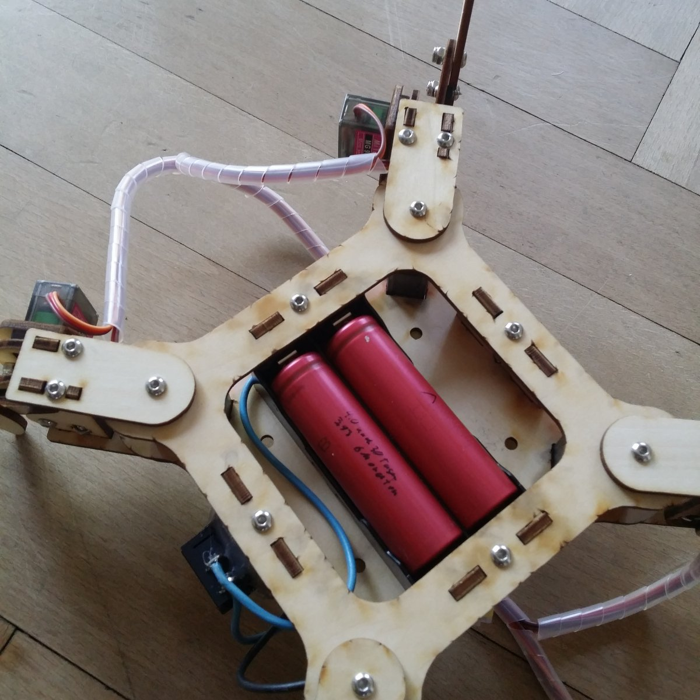
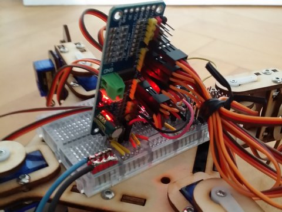

# QuadrupedControl a quadruped / mePed V2 spider robot control library
Available as "QuadrupedControl" example of Arduino library "ServoEasing"

Arduino library for generating all the quadruped movements. It also controls the optional IR receiver and NeoPixels.

## YouTube video of mePed V2 in action controlled by an IR remote (SimpleQuadrupedControl example).

Smooth servo movements are controlled by the [Servo easing library for Arduino](https://github.com/ArminJo/ServoEasing).
For lifting the legs, the lift servos just use the easing type EASE_QUADRATIC_BOUNCING.

### A very simple and easy to understand version of controlling a mePed can be found [here](https://github.com/oracid/Easy-Quadruped-kinematic)

# Compile options / macros for this software
To customize the software to different car extensions, there are some compile options / macros available. 
Modify it by commenting them out or in, or change the values if applicable. Or define the macro with the -D compiler option for global compile (the latter is not possible with the Arduino IDE, so consider using [Sloeber](https://eclipse.baeyens.it). 

| Option | Default | File | Description |
|-|-|-|-|
| `QUADRUPED_HAS_IR_CONTROL` | disabled | QuadrupedControl.h | IR remote control is enabled. |
| `IR_RECEIVER_PIN` | A0 | QuadrupedControl.h | Pin for IR remote control sensor. |
| `QUADRUPED_HAS_NEOPIXEL` | disabled | QuadrupedControl.h | Neopixel animations on a 24 pieces Neopixel strip handled logically as 3 8 pieces strips is enabled. |
| `QUADRUPED_HAS_US_DISTANCE` | disabled | QuadrupedControl.h | US distance sensor at pin A3 + A4 and a pan servo at pin 13 are enabled. The distance can be displayed on the middle/front 8 pieces of the Neopixel strips |
| `QUADRUPED_PLAYS_RTTTL` | disabled | QuadrupedControl.h | The Quadruped play a melody. |

Bottom view of my mePed. You can see the two lipos connected parallel resulting in a 4.2 to 3.6 volt supply.

Using a PCA9685 expander for the servos, gaining pins for other purposes.
