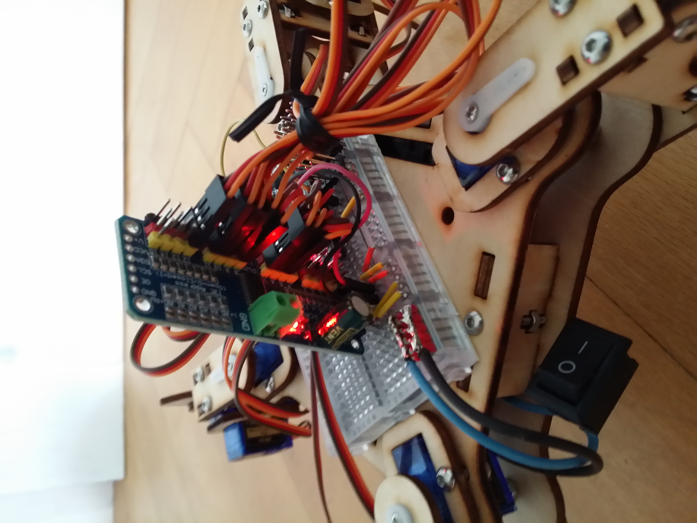

# QuadrupedControl a quadruped / mePed V2 spider robot control library
Arduino library for generating all the quadruped movements for controlling a mePed robot V2 with 8 servos. It also controls the optional IR receiver and NeoPixels.

Used in the "QuadrupedControl" example of Arduino library [ServoEasing](https://github.com/ArminJo/ServoEasing/tree/master/examples/QuadrupedControl).

## YouTube video of mePed V2 in action controlled by an IR remote (SimpleQuadrupedControl example).

Smooth servo movements are controlled by the [Servo easing library for Arduino](https://github.com/ArminJo/ServoEasing).
For lifting the legs, the lift servos just use the easing type EASE_QUADRATIC_BOUNCING.

### A very simple and easy to understand version of controlling a mePed can be found [here](https://github.com/oracid/Easy-Quadruped-kinematic)

# Compile options / macros for this software
To customize the software to different requirements, there are some compile options / macros available. 
Modify them by enabling / disabling them, or change the values if applicable.

| Option | Default | File | Description |
|-|-|-|-|
| `QUADRUPED_HAS_IR_CONTROL` | disabled | QuadrupedConfiguration.h | IR remote control is enabled. |
| `IR_INPUT_PIN` | A0 | QuadrupedConfiguration.h | Pin for IR remote control sensor. |
| `PIN_BUZZER` | 3 | QuadrupedConfiguration.h | Pin for buzzer / piezo. |
| `QUADRUPED_HAS_NEOPIXEL` | disabled | QuadrupedConfiguration.h | NeoPattern animations on a 24 pieces Neopixel strip handled logically as 3 8 pieces strips is enabled. |
| `QUADRUPED_HAS_US_DISTANCE` | disabled | QuadrupedConfiguration.h | US distance sensor at pin A3 + A4 is enabled. The distance is displayed on the middle/front 8 pieces of the Neopixel strips. |
| `QUADRUPED_HAS_US_DISTANCE_SERVO` | disabled | QuadrupedConfiguration.h | A pan servo for the US distance sensor is enabled at pin 13. |
| `QUADRUPED_PLAYS_RTTTL` | disabled | QuadrupedConfiguration.h | The quadruped plays a melody at startup. |
| `QUADRUPED_1_WITH_DVD_REMOTE`, `QUADRUPED_2_WITH_LAVWIN_REMOTE`, `QUADRUPED_3_WITH_KEYES_CLONE_REMOTE` | disabled | QuadrupedConfiguration.h | 3 predefined configurations. |

### Changing include (*.h) files with Arduino IDE
First, use *Sketch > Show Sketch Folder (Ctrl+K)*. 
If you have not yet saved the example as your own sketch, then you are instantly in the right library folder. 
Otherwise you have to navigate to the parallel `libraries` folder and select the library you want to access. 
In both cases the library source and include files are located in the libraries `src` directory. 
The modification must be renewed for each new library version!

### Modifying compile options / macros with PlatformIO
If you are using PlatformIO, you can define the macros in the *[platformio.ini](https://docs.platformio.org/en/latest/projectconf/section_env_build.html)* file with `build_flags = -D MACRO_NAME` or `build_flags = -D MACRO_NAME=macroValue`.

### Modifying compile options / macros with Sloeber IDE
If you are using [Sloeber](https://eclipse.baeyens.it) as your IDE, you can easily define global symbols with *Properties > Arduino > CompileOptions*. 

Bottom view of my mePed. You can see the two lipos connected parallel resulting in a 4.2 to 3.6 volt supply.

Using a PCA9685 expander for the servos, gaining pins for other purposes.
